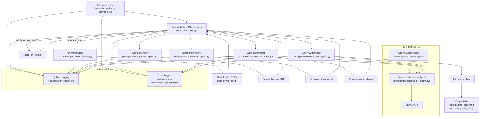

# Research Co-Pilot Architecture

This document captures a high-level architecture diagram for the `research_copilot` project.

## System Overview

## Notes

- `ReproducibleOpenAIAgent` is constructed in `src/main.py` using `OpenAIAgentConfig` from the MOYA library and then injected into `SummarizerAgent`, `SynthesizerAgent`, and `SurveyWriterAgent`.
- The orchestrator (`ResearchCopilotOrchestrator`) coordinates all agents and decides whether to mine PDFs from arXiv via `PDFMinerAgent` or use an existing local PDF folder.
- Observability is implemented via:
  - Standard Python logging to `logs/research_copilot.log`.
  - A JSONL trace logger (`get_trace_logger`) that records workflow, decisions, LLM requests/responses, and errors into `logs/trace.jsonl`.
